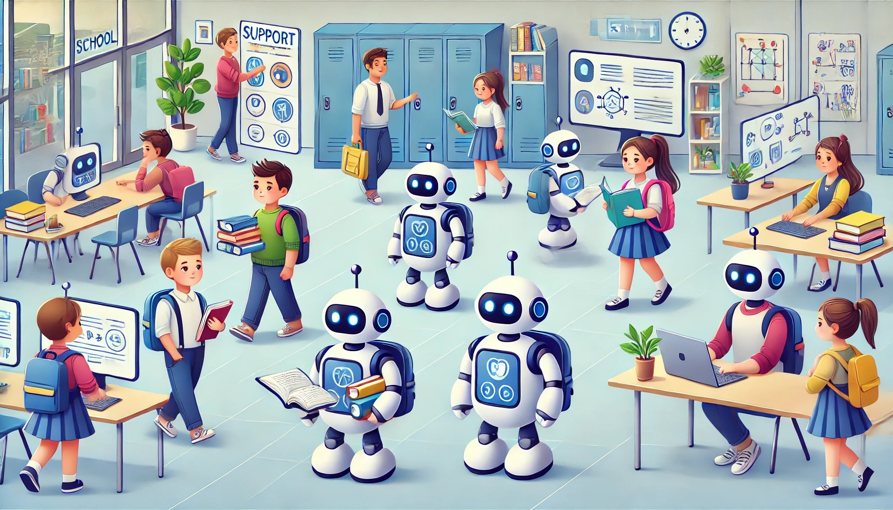

# Szenario: Persönliche Lernassistenz (Lernhelfer)

{} Alle Bilder in diesem Rollenspiel wurden mit DALL E hergestellt. Der Prompt für dieses Bild ist "An illustration showing multiple students each accompanied by their own small friendly robot in a school setting". Diskutiert gerne welche Vorstellungen - beispielsweise von Geschlecht und Hautfarbe - die KI mit diesem Bild darstellt.  {}

## Einführung für die Teilnehmenden

In diesem Szenario werden neue KI-Lernassistenzen im Schulalltag eingesetzt. Diese digitalen Helfer sind dafür da, jedem Schüler und jeder Schülerin beim Lernen zu helfen. Die moderne Technik soll herausfinden, was jede Einzelne braucht.

Die KI-Assistenzen schauen genau, wie jede Person lernt, was sie gut können und wo sie noch Hilfe brauchen. Sie geben dann passende Aufgaben, die genau auf die Person zugeschnitten sind. Das bedeutet, dass zwei Schüler\*innen im gleichen Fach unterschiedliche Aufgaben bekommen können, je nachdem, was für sie gerade wichtig ist.

Ein wichtiger Punkt ist, dass die KI den Lernfortschritt genau verfolgt. Wenn eine Person in einem Bereich Probleme hat, bietet die KI sofort Hilfe oder zusätzliche Erklärungen an. Sie merkt sich auch Erfolge, was motivieren kann.

Außerdem helfen die KI-Assistenzen dabei, den Lernplan zu organisieren. Sie erstellen Pläne, die auf die Ziele und den Zeitplan der jeweiligen Schüler\*in abgestimmt sind. Sie erinnern auch an Aufgaben, Prüfungen oder Abgabetermine, damit die Schüler\*innen nichts vergessen.

Diese KI-Lernassistenzen sollen Lehrkräfte nicht ersetzen, sondern ihnen helfen. Sie geben den Lehrer\*innen genaue Informationen darüber, wie jede*r Schüler\*in lernt, damit die Lehrer besser helfen können.

## Zusammenfassung

Was die KI-Lernassistenzen können:

- Sie lernen, wie jede Person am besten lernt.
- Sie geben einzelnen Schüler\*innen passende Aufgaben.
- Sie merken, wenn ein Mensch Hilfe braucht und erklären dann mehr.
- Sie loben Schüler\*innen für gute Leistungen.
- Sie helfen beim Planen des Lernens.
- Sie erinnern an wichtige Termine.
- Sie hilft den Lehrkräften, einzelne Schüler\*innen besser zu unterstützen.

\newpage
