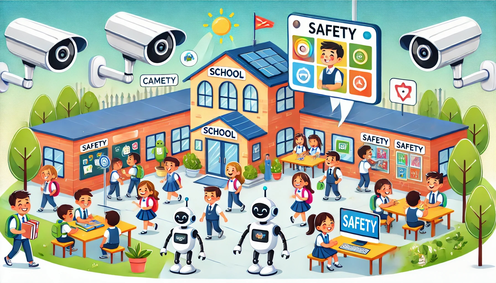

# Szenario: Sicherheit mit KI

## Einführung für die Teilnehmer\*innen

In einem modernen Schulgebäude, das mit der neuesten Technologie ausgestattet ist, wird Künstliche Intelligenz (KI) genutzt, um Sicherheit und Disziplin zu gewährleisten und das Schüler\*innenverhalten zu überwachen. Überall im Gebäude sind Kameras und Sensoren angebracht, die das Geschehen in Echtzeit erfassen und analysieren. Diese Systeme sind in der Lage, Verhaltensmuster zu erkennen und bei Bedarf Alarm zu schlagen oder Lehrkräfte zu informieren.

In den Klassenzimmern unterstützen interaktive Bildschirme und KI-Assistenzen den Unterricht, indem sie Informationen bereitstellen und an Termine erinnern. Die KI-Systeme sind auch darauf programmiert, die Teilnahme und Aufmerksamkeit der Schüler\*innen zu überwachen und bei Auffälligkeiten entsprechende Maßnahmen zu ergreifen.

Die Schule nutzt diese Technologie, um ein sicheres und produktives Lernumfeld zu schaffen. Sie zielt darauf ab, Störungen zu minimieren, das Lernen zu optimieren und frühzeitig Probleme wie Mobbing oder emotionale Schwierigkeiten bei Schüler\*innen zu erkennen.

## Zusammenfassung

In dieser Situation gibt es eine moderne Schule mit viel Technik. Die Schule nutzt KI (Künstliche Intelligenz), um auf die Schüler aufzupassen und deren Verhalten zu beobachten.
So funktioniert es:

- Überall in der Schule gibt es Kameras und Sensoren.
- Die KI schaut sich alles an und meldet Probleme.
- In den Klassenräumen gibt es Bildschirme, die beim Lernen helfen.
- Die KI achtet darauf, ob Schüler mitmachen und aufpassen.

Ziele der Schule:

- Ein sicherer Ort zum Lernen sein
- Störungen verhindern
- Probleme wie Mobbing früh erkennen

Die Schule möchte so das Lernen verbessern. Aber es ist wichtig zu wissen, dass die Schüler dabei die ganze Zeit beobachtet werden.

\newpage
