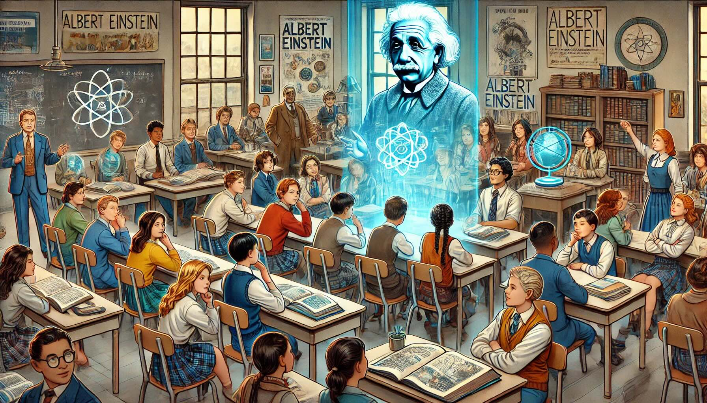

# Szenario: KI-gesteuerter Geschichtsunterricht

## Einführung für die Teilnehmer
In diesem Szenario wird eine fortschrittliche KI-Technologie im Geschichtsunterricht eingesetzt, um ein spannendes und realistisches Lernerlebnis zu bieten. Mit dieser KI können die Schüler virtuell mit historischen Figuren sprechen, egal ob es sich um berühmte Persönlichkeiten oder um normale Menschen aus verschiedenen Zeiten handelt. Die Schüler können diesen Figuren direkt Fragen stellen und sich über wichtige Ereignisse, das Alltagsleben oder die Kultur der jeweiligen Zeit unterhalten. Diese Methode soll dazu beitragen, dass die Geschichte lebendig wird und die Schüler ein besseres Verständnis für historische Zusammenhänge bekommen.

## Zusammenfassung KI-Zeitreise im Geschichtsunterricht

In dieser Situation nutzt der Geschichtsunterricht eine neue KI-Technik. Sie lässt Schüler mit Menschen aus der Vergangenheit "sprechen".
So funktioniert es:

- Schüler tauchen in eine virtuelle Welt ein.
- Dort treffen sie auf Menschen aus der Geschichte.
- Sie können diesen Menschen Fragen stellen.
- Sie lernen, wie das Leben früher war.

Ein Beispiel:
Du lernst über das alte Ägypten. Die KI bringt dich in eine virtuelle Welt am Nil. Dort triffst du Kleopatra. Du kannst sie fragen, wie es war, Königin zu sein oder wie ein Tag im Palast ablief.
Ziel ist es, Geschichte spannend und lebendig zu machen.

\newpage
