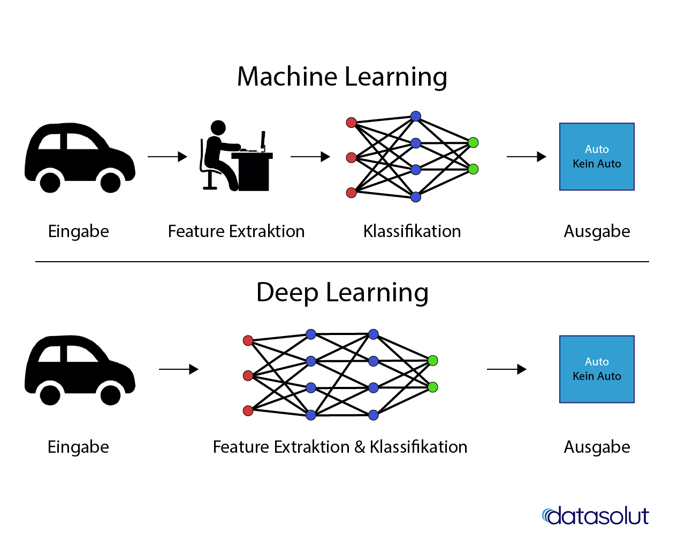

# **Übersicht - was ist KI?**

Gregor Walter - KidsLab.de

---

Künstliche Intelligenz (KI), auch artifizielle Intelligenz (AI), englisch artificial intelligence, ist ein Teilgebiet der Informatik, es umfasst alle Anstrengungen, deren Ziel es ist, Maschinen intelligent zu machen. Dabei wird Intelligenz verstanden als die Eigenschaft, die ein Wesen befähigt, angemessen und vorausschauend in seiner Umgebung zu agieren; dazu gehört die Fähigkeit, Sinneseindrücke wahrzunehmen und darauf zu reagieren, Informationen aufzunehmen, zu verarbeiten und als Wissen zu speichern, Sprache zu verstehen und zu erzeugen, Probleme zu lösen und Ziele zu erreichen. 

Quelle: Wikipedia

---

Quelle: https://datasolut.com/was-ist-deep-learning/

---

# ... und dann kam ChatGPT

- Veröffentlichung September 2022
- 1 Million Nutzer*innen in den ersten 5 Tagen - obwohl begrenzt <!--versteh ich nicht: was heißt 'obwohl begrenzt?-->
- sehr sehr einfach zu bedienen - ohne Vorwissen
- fhlt sich wie ein Chat mit einem Menschen an

---

# Erzeugen als PDF
##  Beispiel: VSCode

1. Extension installieren
    - 
1. PDF generieren
    - 

---

# Machine Bias

## Haben Computer Vorurteile?

---

https://ki-campus.org/videos/wasistki

https://www.youtube.com/watch?v=Z8jMKp6wd9g

