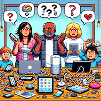

---
title: "Rollenkarte: Eltern"
subject: "Markdown"
keywords: [Markdown, Example]
lang: "de"
colorlinks: true
header-includes:
- |
  ```{=latex}
  \usepackage{awesomebox}
  ```
pandoc-latex-environment:
  noteblock: [note]
  tipblock: [tip]
  warningblock: [warning]
  cautionblock: [caution]
  importantblock: [important]
...


# Rollenkarte: Eltern



# Maren und Thomas (die Eltern)

Du bist Maren, 42 Jahre alt, und dein Mann ist Thomas, 45 Jahre alt. Ihr seid die Eltern von Sam. Maren arbeitet als Bürokauffrau, und Thomas ist Mechaniker in einer Autowerkstatt.
Ihr seid beide mit Computern vertraut. Besonders Sams Begeisterung für neue Apps, Spiele und soziale Medien macht euch oft ratlos. Ihr versucht mitzuhalten, aber es fällt euch nicht immer leicht zu verstehen, was Sam da eigentlich den ganzen Tag am Handy macht.
In eurer Freizeit geht ihr gerne gemeinsam ins Kino oder trefft euch mit Freund\*innen zum Grillen. Ihr schätzt den persönlichen Kontakt und macht euch Sorgen, dass Sam zu viel Zeit online verbringt.

\newpage


## Problemstellung
- Wie denkst du, wird diese Technologie die Bildung und das tägliche Leben deines Kindes beeinflussen?
- Welche Sorgen hast du in Bezug auf Datenschutz und die Zeit, die dein Kind mit Technologie verbringt?

## Persönliche Betroffenheit
- Überlege, wie du dein Kind unterstützen kannst, um sicherzustellen, dass es von der Technologie profitiert und nicht überwältigt wird.
- Wie könntest du mit Lehrkräften und der Schule kommunizieren, um die besten Ergebnisse für dein Kind zu erreichen?

# Hintergrund
- Denke darüber nach, wie diese Technologie das Lernen und die Entwicklung deines Kindes fördern kann. Welche Chancen siehst du?
- Wie könntest du dich über die Technologie informieren und ein Teil der Diskussion über ihre Nutzung in der Schule sein?

\newpage


## Argumente

### Pro

-
-
-
-

### Contra

-
-
-
-

## Entscheidung: Chance oder Risiko?


## Action Plan

Ideen und Schritte, die helfen, das Beste aus der Situation herauszuholen und Probleme zu vermeiden. Dabei geht es auch darum, was jede Person tun kann, um gute Ergebnisse zu erreichen oder Schwierigkeiten zu verhindern.

-
-
-
-
-
-
